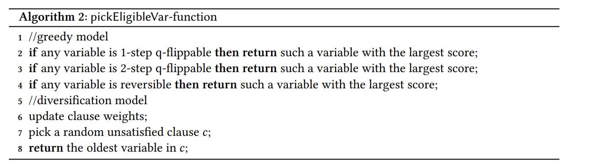
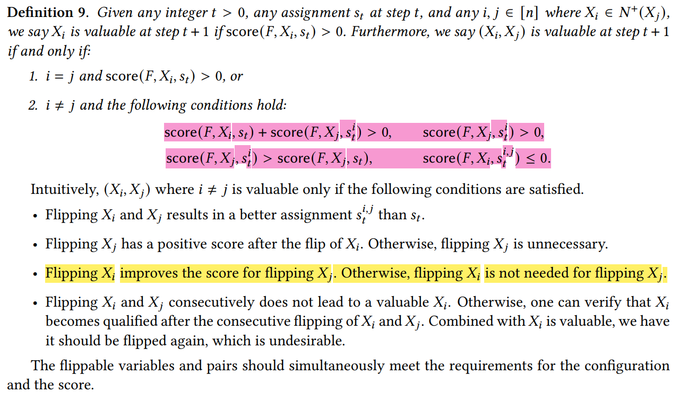
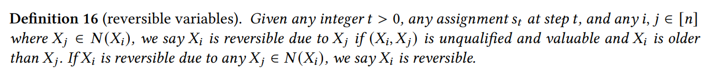

# improved-CC
improved CC strategy for SAT

## algorithm

## general notation
- $L1(x_i),L2(x_i)$: 分别记录 $N(x_i)$ 中前一次和前两次翻转的变量。
- $N(F,x_i,s)$: $F$ 在赋值 $s$ 下翻转$x_i$的时候造成满足子句的差异.

## valuable pairs

## reversible variable

## 4.3.2 critical pairs
- $Cpair$: the list of critical pairs.
- $LCP(x_i)$: 包含 $x_i$ 的 $Cpair$ 子集.
- $LCC(x_i,x_j)$:  同时包含 $(x_i,x_j)$ 的子句，其中 $(x_i,x_j) \in Cpair$。
- LCQ: critical 且 flippable的pair集合
根据 $L1(x_i),L2(x_i),N(F,x_i,s),N(F,x_j,s)$ 再考虑 $x_i,x_j$ 同时出现的子句。

- LCR: critical 且 reversible的集合

目前的代码中，对于单元子句的检查仅限于计算文字数量，也就是说 $(x_1,x_1,x_1) \red{不会}$ 被视为单元子句，那么random-3 SAT不会有两个变量的子句

## 4.3.3 noncritical variables
- $U(x_i)$: 取 0/1 表示 $x_i$ 的邻居(包含 $x_i$ 本身)自从上一次算法执行line3 or 4之后有没有翻转过

- $LU$: $U(x_i)= 1$ 的集合

- 论文中的 $N(c)$ 其实就是原始代码中的sat_count[c]

- $LN$ : sat_count=1的non_critical子句集合

- $LN(x_i)$ : $LN$ 中包含 $x_i$ 的子句集合

- 𝑇 (𝐶) denotes the step at which 𝑄(𝐶), 𝑅(𝐶), 𝑆 (𝐶), 𝑃 (𝐶) are updated.

- $Q(C)$: 子句 $C$ 中是否包含q-flipapble pairs

- $R(C)$: 子句 $C$ 中是否包含reversible pairs

- $P(C)$: corresponding pair with highest score

- $S(C)$: corresponding score

## 3/17晚上
- qualified pairs (xi,xj) 的判断：首先对于每个变量记录一个改变队列
分几种情况xi
1. 如果xi改变队列里面的变量是相同的，那么就是q
2. 如果变量不同，而且
2.1  xi不在里面，那么就是q
2.2  xi，xj在里面 这时看xj的改变队列，如果也是xi,xj 非q
